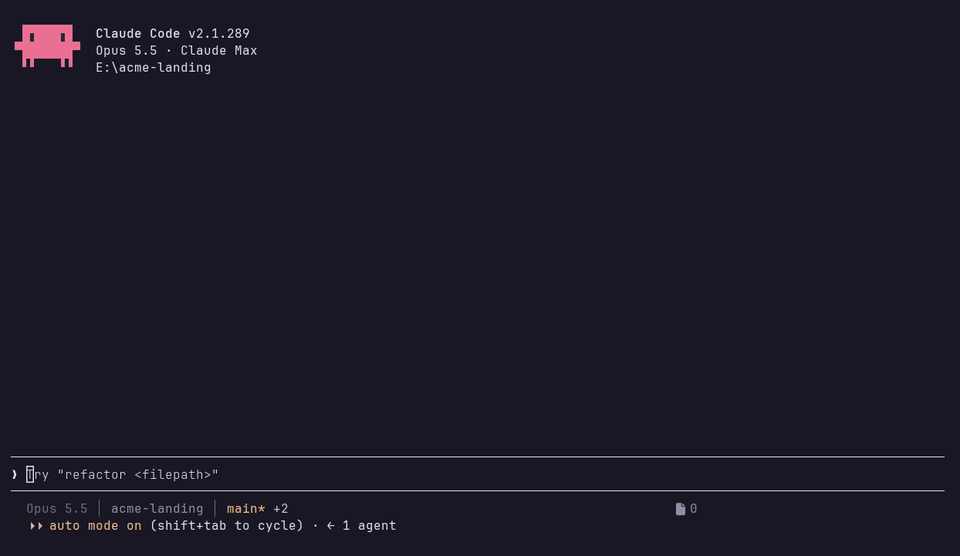
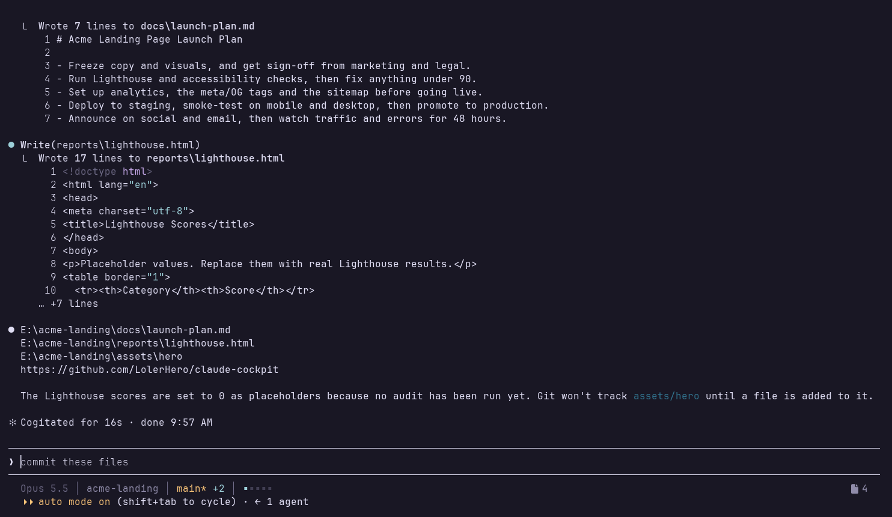
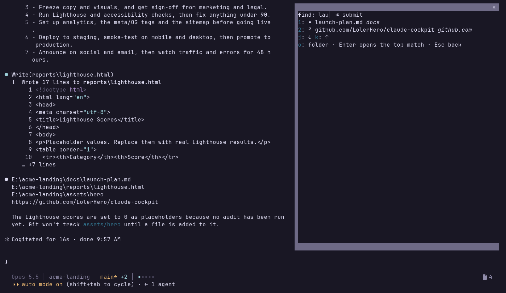

# claude-cockpit

A denser Claude Code status line and a pane of the files, links and folders your session produced, with a fuzzy filter.



## What you get

The status line, one row:

```
Opus 5.5 │ Coding │ main* +12 -3 │ ▪▪▪▪▪                  3  ·  1h 20m
```



- `Opus 5.5` is the model.
- `Coding` is the directory the session runs in.
- `main*` is the branch, with `*` when there is uncommitted work, `↑2 ↓1` when it is ahead of or behind its upstream, and `detached` in red when there is no branch.
- `+12 -3` is the lines added and removed against `HEAD`, shown only when the tree is dirty.
- `▪▪▪▪▪` is the context window, one square per 20 %. It turns from calm to yellow to red as it fills.
- `3` (after a file icon) is how many rows the Files pane holds: files, links and folders alike.
- `1h 20m` (after a clock icon) is how long the session has run.

When the terminal is too narrow, segments drop in this order: model, directory, file count, churn, clock, branch, and the context bar last. The row never wraps.

The pane opens with `/files` or `ctrl+x f`. It is the session's hub: the files, links and folders this session produced, newest first, eight to a page, the newest 48 kept. Each row starts with its kind (`▪` file, `↗` link, `▸` folder) and ends with a muted tail that says where it is: the file's folder, the link's host and port, the folder's parent.

Keys: Enter or the row's digit (`1`–`8`) opens the row; `j`/`k` move the selection and wrap around (`k` on the first row reaches the last entry of the last page, `j` on the last entry the first row); `h`/`l` turn the page and wrap likewise; `o` opens the folder the row sits in (a folder opens itself; a link has none); `f` finds: a field appears, the list narrows as you type (fuzzy, over the name and the tail, in any order of characters), Enter opens the top match, Esc returns to the list; Esc in the list closes the pane. The arrows and Tab also walk the selection, since a pane cannot bind them. A thing that opened takes you to another app and the pane closes behind it. When the newest file is a PNG, it is also drawn in the pane, in terminals that can show pictures (kitty and Ghostty); elsewhere a line says so. The preview hides while you filter.



What counts:

- **A file** when a person would open it: documents, images, spreadsheets, slides, archives, Markdown and HTML, written by a tool or produced by a command. Source code never counts, since that belongs in your editor. Also an absolute path to one alone on a reply line, when the file exists (Claude listing files it wants you to see). A `file://` link in a reply counts on the same lines a web link does (see below) and becomes the file or folder row it points at.
- **A link** from a tool: an artifact publish, a `gh pr create` / `gh issue create` / `gh release create`, a deploy tool (`mcp__*deploy*`), and a dev server a command started (`localhost`, `127.0.0.1`, a LAN address with a port; `0.0.0.0` is shown as `localhost`). Other URLs in command output (registry notices, docs) are not collected. And from a reply, as it streams: a link alone on its line (bare, a bullet, or `[text](url)`), or on a line that contains one of the open words — `open, öffne, ansehen, view, review` by default, the `openWords` option in the config menu.
- **A folder** this session made: `mkdir` and `git worktree add` in a command (once it exists), and an absolute path alone on a reply line that is a directory.

A file or folder that vanished drops off the list; a link is never checked. The status-line count is every row the pane holds.

## Requirements

- Claude Code 2.1.289 or later. Built and tested against 2.1.289. The plugin hooks API is young and may move.
- Node 22 or later.
- A Nerd Font for the file and clock icons, or set glyphs to `plain`.
- wezterm is optional. With it the status line reads the exact pane width. Without it, it uses the width the mod measured, and 80 columns if that is missing.

## Install

```
git clone https://github.com/LolerHero/claude-cockpit
cd claude-cockpit
node setup.mjs            # add --palette tokyo-night, --glyphs plain, --dry-run, --force
```

Then restart `claude`. To stay on a release tested against your Claude Code build, clone its tag instead (`git clone --branch v0.1.0 …`); [CHANGELOG.md](CHANGELOG.md) names the build each release was tested on.

What setup changes, in `~/.claude` (or `CLAUDE_CONFIG_DIR`):

- `settings.json` → `statusLine` runs `statusline/statusline.mjs`. A status line you already have is kept unless you pass `--force`.
- `settings.json` → `env.CLAUDE_CODE_PLUGIN_DIRS` gains this folder, so the plugin loads in every session.
- `keybindings.json` → `ctrl+x f` opens `/files`, unless that chord is already bound to something else.

`settings.json` is backed up next to itself before the first write. `--dry-run` prints the changes and writes nothing.

## Palettes

`rose-pine` (the default), `catppuccin-mocha`, `tokyo-night` and `ansi`. `ansi` uses your terminal's own 16 colors, so it follows whatever theme you run and works without truecolor.

The palette, the glyphs and the open words are options of the `cockpit` plugin in Claude Code's config menu. Change them there and the next redraw picks them up (`openWords` on the next session).

## How it works

The mod runs inside Claude Code and writes the file count and the terminal width to `~/.claude/cockpit/<session id>.json`, one small file per session, so two open sessions never mix their numbers. The status line is a separate Node process that reads its session's file, plus `settings.json` for your options. Both draw from `palettes.js`: the status line its colours, the Files pane its ground (`base`), with your terminal's own foreground on it.

## Check it

```
claude plugin validate .
claude plugin test .
node --test "test/*.test.mjs"
```

## License

MIT
